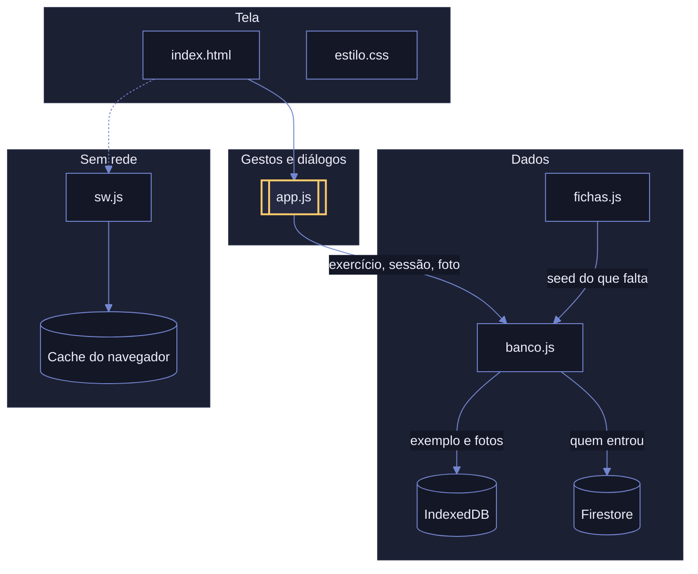
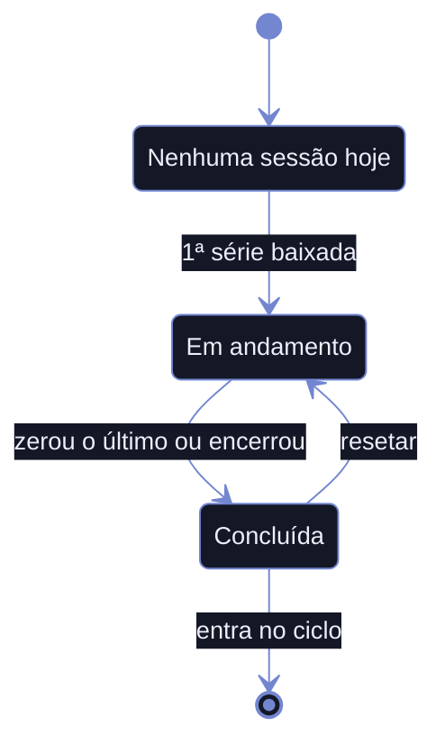
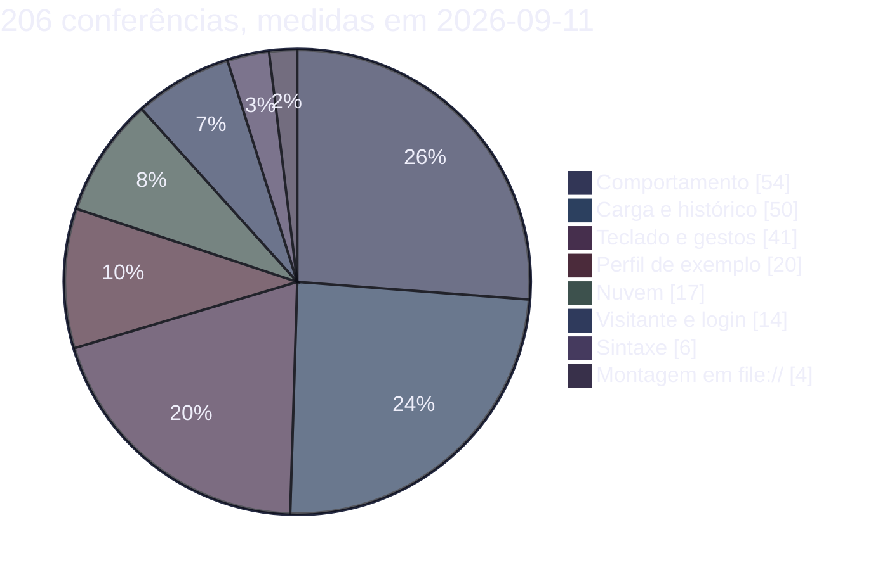

<div align="center">


# Sunshine

Contador de séries para treino de academia.
Instalável, sem build, abre sem rede, e o histórico segue a pessoa entre aparelhos.

[**Abrir o app**][app]

</div>

## O mapa

Uma camada só conhece o armazenamento. O resto fala em exercício, sessão e vaga de foto. Quem
entrou treina na nuvem; quem só abriu o link vê um perfil de exemplo que fica no aparelho.



Cilindro é armazenamento, retângulo é arquivo do app, contorno amarelo é quem decide a quem
chamar.

## O treino de hoje é o próprio histórico

Não são duas coisas, então não existe passo de salvar no fim.



Encerrar no meio grava o executado, e o pulado entra com zero. Resetar escreve o total de volta em
vez de apagar, porque histórico não se exclui.

## Onde a suíte olha



Sem framework de teste. Um servidor `node:http` injeta uma sonda na página, e a página devolve o
resultado por `fetch`. Os casos rodam três de cada vez, cada um no seu perfil de Chrome, e
`node verificar.mjs carga` roda só o que casa com a palavra.

## O que ele faz

| Recurso              | Comportamento                                                                                                                      |
| -------------------- | ---------------------------------------------------------------------------------------------------------------------------------- |
| Contador de séries   | Um toque desce uma série. Segurar e arrastar ajusta no lugar, como o seletor de hora do celular. As setas do teclado fazem o mesmo |
| Carga do dia         | Um número por exercício, herdado da última vez. Sobe, cai ou fica, e o cartão diz qual                                            |
| Três tipos de exercício | Peso na máquina, peso do corpo sem número nenhum, e aeróbico com tempo mais velocidade ou nível                                |
| Histórico            | O treino inteiro por exercício, com a progressão dia a dia e o que saiu do treino                                                 |
| Ciclo de treinos     | De um treino em diante, com nomes livres. Concluir todos libera o reinício                                                        |
| Trocar de treino     | Toque na letra, deslize como quem vira página, ou as setas do teclado                                                             |
| Detalhe do exercício | Aparelho, código do vídeo, três fotos da máquina, da câmera ou da galeria, e um campo para as regulagens                          |
| Foto em tela cheia   | Pinça, arrasto e toque duplo                                                                                                      |
| Login                | Usuário e senha, uma vez por aparelho. Cada pessoa vê só o próprio treino; quem só abre o link vê o perfil de exemplo             |
| Dois aparelhos       | O treino gravado num celular aparece no outro, e o app continua funcionando sem sinal                                             |

## Por que assim

| Decisão                                             | Motivo                                                                                                               |
| --------------------------------------------------- | -------------------------------------------------------------------------------------------------------------------- |
| Scripts clássicos, não módulos                      | `type="module"` não executa em `file://`, e a página precisa abrir com dois cliques                                  |
| Id fixo escrito no código                           | O catálogo é compartilhado entre aparelhos, e id sorteado em cada um duplicaria tudo na primeira sincronização       |
| Gestos por pointer events                           | A pinça nativa ampliaria a página inteira junto com o diálogo. Todo gesto tem equivalente de teclado                 |
| Trocar de treino por scroll snap                    | Um painel por treino num trilho. O conteúdo segue o dedo, volta sozinho no meio do gesto, e a física é a do sistema  |
| Remover exercício é arquivar                        | O peso foi levantado. Ele sai da lista do dia, continua no histórico, e volta pelo botão que está lá                 |
| Rede primeiro na navegação, cache primeiro no resto | Versão nova aparece já na primeira abertura com sinal, e abrir rápido na academia vale mais que o CSS da última hora |
| Firestore lido por espelho em memória               | Com sinal ruim, `get()` espera o servidor por segundos. O app assina cada coleção e responde do espelho, na hora     |
| Um branch por pessoa, e o exemplo fica local        | Ninguém escreve no documento de outro, então dois celulares offline nunca colidem. O visitante interage e nada sobe   |
| `<dialog>` nativo                                   | Prisão de foco, Escape, foco de volta no gatilho e fundo inerte vêm de graça                                         |

## Rodar

```bash
npx --yes http-server -p 8080     # com Node
python3 -m http.server 8080       # com Python
```

> [!IMPORTANT]
> Por `file://` o app abre mas **não salva nada**. O navegador bloqueia IndexedDB em origem opaca,
> recusa a fonte local e não registra o service worker. Sirva por HTTP para guardar séries e fotos.

## Verificar

```bash
node verificar.mjs
```

<details>
<summary>O que a suíte cobre, e o que ela não alcança</summary>

Nenhum número fica escrito nela: quantos treinos, quantos exercícios, quantas séries e quantas
repetições saem do seed. Trocar o catálogo por quatro treinos de nomes livres, ou por um treino
só, mantém a suíte verde.

Cobre contador, ajuste por arrasto, encerramento, reset, ciclo, perfis, fotos, observação, zoom,
teclado, instalação, login e a nuvem. O Firebase é de mentira, em memória: a suíte nunca fala com
o projeto de verdade.

É validada por mutação: quebra-se uma linha de propósito e confere-se que a asserção certa fica
vermelha.

Fora do alcance dela, só no aparelho: câmera, instalação na tela inicial e a persistência real do
armazenamento no iOS.

Precisa de Node 20.11 ou mais novo e do Chrome instalado. Se o Chrome estiver noutro caminho,
acrescente em `CAMINHOS_CHROME`.

</details>

<details>
<summary>Os arquivos</summary>

| Arquivo         | Conteúdo                                                             |
| --------------- | -------------------------------------------------------------------- |
| `index.html`    | Só a marcação                                                        |
| `estilo.css`    | Tokens de cor e todo o estilo                                        |
| `mulish.woff2`  | A fonte, servida do próprio repositório para funcionar sem rede      |
| `fichas.js`     | Os exercícios, os perfis, o treino de exemplo e as contas            |
| `banco.js`      | Acesso a dado. Único arquivo que toca IndexedDB, localStorage e Firebase |
| `app.js`        | Tela, gestos e diálogos                                              |
| `vendor/`       | O SDK do Firebase, em script clássico, guardado para abrir sem rede  |
| `sonda.js`      | As asserções que rodam com o app montado no navegador                |
| `sonda-firebase.js` | O Firebase de mentira que a suíte injeta no lugar do SDK         |
| `sw.js`         | Service worker. Guarda o app para abrir sem rede                     |
| `manifest.json` | Nome, cores e ícones da instalação                                   |
| `icone.svg`     | Fonte dos ícones. Os PNG saem dele                                   |
| `verificar.mjs` | Verificação sem celular. Serve o app, sobe o Chrome e lê o resultado |

A ordem dos scripts em `index.html` importa: `vendor/`, depois `fichas.js`, `banco.js` e `app.js`.

</details>

[app]: https://v-amorim.github.io/academia/
