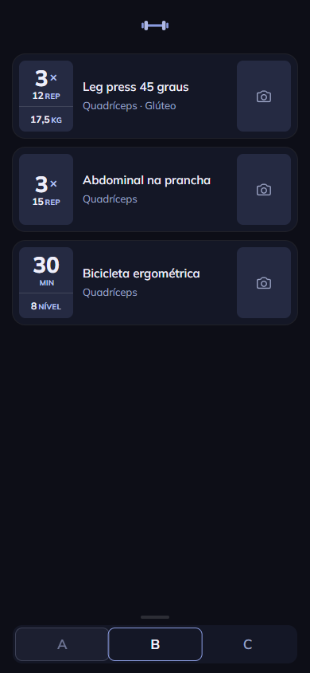
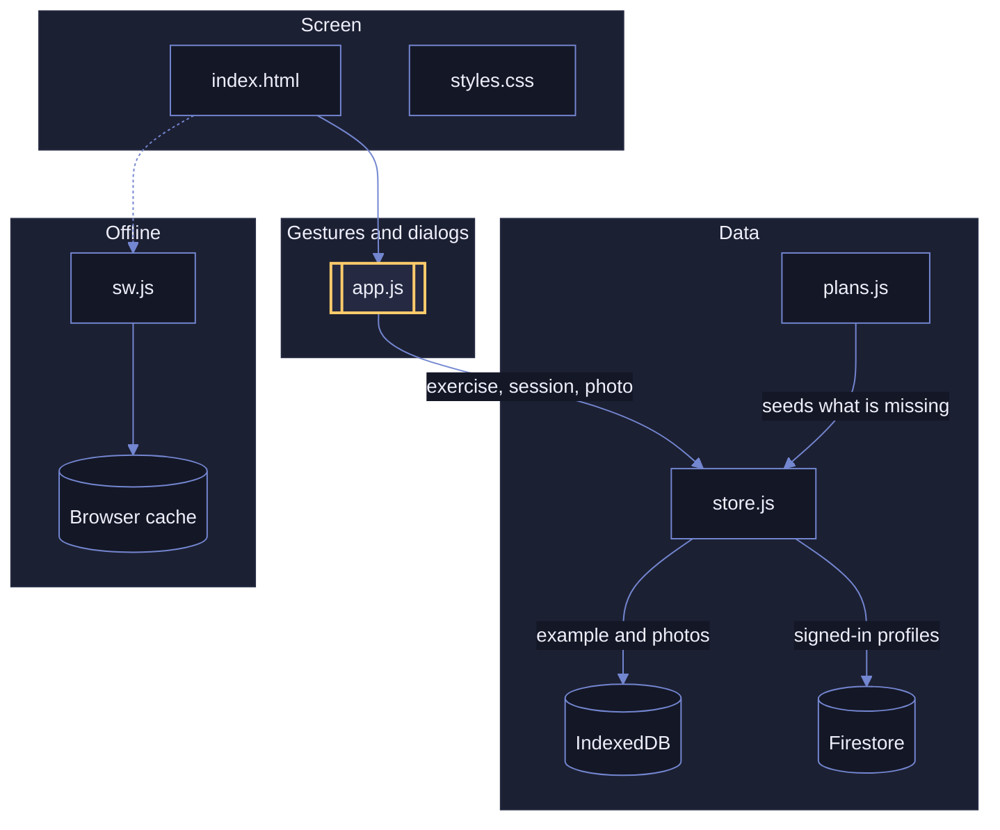
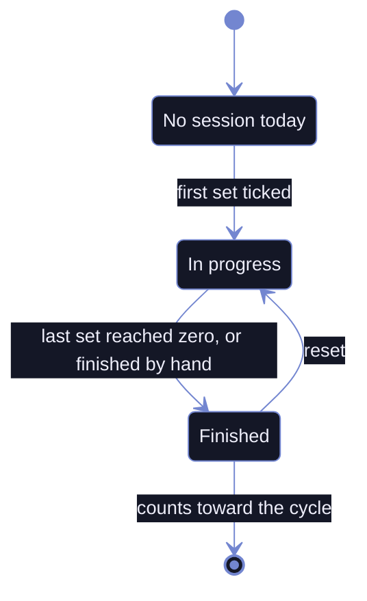
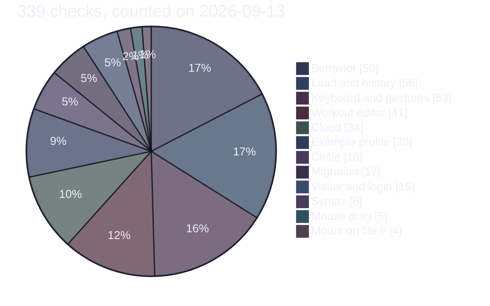

<div align="center">


# Sunshine

A set counter for gym workouts.
Installable, no build step, works offline, and the history follows the person across devices.

[**Open the app**][app]

</div>

| |
| :---: |
|  |

## The map

One layer alone knows about storage. Everything else speaks in exercises, sessions and photo
slots. Whoever signs in trains in the cloud; whoever just opens the link sees an example profile
that stays on the device.



A cylinder is storage, a rectangle is an app file, the yellow outline is the one that decides
whom to call.

## Today's workout is the history itself

They are not two things, so there is no save step at the end.



Finishing midway records what was done, and skipped exercises go in with zero. Reset writes the
full count back instead of deleting, because history is never erased.

## Where the suite looks



No test framework. A `node:http` server injects a probe into the page, and the page posts the
result back with `fetch`. Cases run three at a time, each in its own Chrome profile, and
`node verify.mjs cloud` runs only the cases matching the word.

## What it does

| Feature | Behavior |
| --- | --- |
| Set counter | One tap ticks a set. Hold and drag adjusts in place, like the phone's time picker. Keyboard arrows do the same |
| Today's load | One number per exercise, inherited from last time. Up, down or level, and the card says which |
| Three exercise kinds | Machine weight, bodyweight with no number at all, and cardio with time plus speed or level. Time adjusts by holding, like sets |
| History | The whole workout by exercise, with day-by-day progression and what left the workout |
| Workout cycle | One workout or more, with free names. Finishing all of them unlocks the restart |
| Switching workouts | Tap the tab, swipe like turning a page, drag with the mouse, or use the arrow keys |
| Exercise details | Station, video code, a photo of the machine from camera or gallery, reps per set and a field for the settings |
| Workout editor | Rename, create, reorder and remove workouts; move, reorder, remove and create exercises. All on the screen itself, nothing deletes data |
| Attachments | Twenty-one pulley and free-weight attachments drawn from the gym, shown as an icon on the card and named in the detail view |
| Shared photos | The photo belongs to the machine: the same exercise in two plans shows the same photo, and it follows to the other device |
| Fullscreen photo | Pinch, drag and double tap |
| Circle | Whoever shares an invite code sees the other's plan, read only, and the card shows who else does the same exercise |
| Login | Username and password, once per device. Each person sees only their own workout; whoever just opens the link sees the example profile |
| Two devices | A workout recorded on one phone shows on the other, and the app keeps working without signal |

## Why this way

| Decision | Reason |
| --- | --- |
| Classic scripts, not modules | `type="module"` does not run on `file://`, and the page has to open with two clicks |
| Fixed ids written in code | The catalog is shared across devices, and an id generated on each one would duplicate everything on the first sync |
| Gestures through pointer events | Native pinch would zoom the whole page along with the dialog. Every gesture has a keyboard equivalent |
| Workout switching by scroll snap | One panel per workout on a track. The content follows the finger, springs back midway, and the physics is the system's |
| Removing an exercise is archiving | The weight was lifted. It leaves the day's list, stays in the history, and comes back through the button that is there |
| Network first for navigation, cache first for the rest | A new version shows on the first opening with signal, and opening fast at the gym is worth more than the last-minute CSS |
| Firestore read through an in-memory mirror | On a weak signal `get()` waits seconds for the server. The app subscribes to each collection and answers from the mirror at once |
| One branch per person, and the example stays local | Nobody writes to anyone else's document, so two offline phones never collide. The visitor interacts and nothing goes up |
| Native `<dialog>` | Focus trap, Escape, focus returned to the trigger and an inert backdrop come for free |
| Screen text in Portuguese, code in English | The two people who train with it read Portuguese; anyone reading the code reads English |

## Run

```bash
npx --yes http-server -p 8080     # with Node
python3 -m http.server 8080       # with Python
```

> [!IMPORTANT]
> Over `file://` the app opens but **saves nothing**. The browser blocks IndexedDB on an opaque
> origin, refuses the local font and does not register the service worker. Serve over HTTP to
> keep sets and photos.

## Verify

```bash
node verify.mjs
```

<details>
<summary>What the suite covers, and what it cannot reach</summary>

No number is hardcoded in it: how many workouts, exercises, sets and reps come from the seed.
Swapping the catalog for four free-named workouts, or for a single one, keeps the suite green.

It covers the counter, drag adjustment, finishing, reset, cycle, profiles, photos, notes, zoom,
keyboard, installation, login, the cloud, the circle and the migration from the Portuguese data
format. Firebase is a fake, in memory: the suite never talks to the real project.

It is validated by mutation: break one line on purpose and check that the right assertion turns
red.

Out of its reach, device only: camera, home-screen installation and real storage persistence on
iOS.

Needs Node 20.11 or newer and Chrome installed. If Chrome lives somewhere else, add the path to
`CHROME_PATHS`.

</details>

<details>
<summary>The files</summary>

| File | Content |
| --- | --- |
| `index.html` | Markup only |
| `styles.css` | Color tokens and every style |
| `mulish.woff2` | The font, served from the repo so it works offline |
| `plans.js` | The exercises, the profiles, the example workout and the accounts |
| `store.js` | Data access. The only file that touches IndexedDB, localStorage and Firebase |
| `app.js` | Screen, gestures and dialogs |
| `vendor/` | The Firebase SDK, as classic scripts, cached to open offline |
| `probe.js` | The assertions that run with the app mounted in the browser |
| `fake-firebase.js` | The fake Firebase the suite injects in place of the SDK |
| `sw.js` | Service worker. Caches the app to open offline |
| `manifest.json` | Name, colors and icons for installation |
| `icone.svg` | Source of the icons. The PNGs come from it |
| `verify.mjs` | Verification without a phone. Serves the app, launches Chrome and reads the result |

Script order in `index.html` matters: `vendor/`, then `plans.js`, `store.js` and `app.js`.

</details>

## License

[MIT](LICENSE).

[app]: https://v-amorim.github.io/academia/
