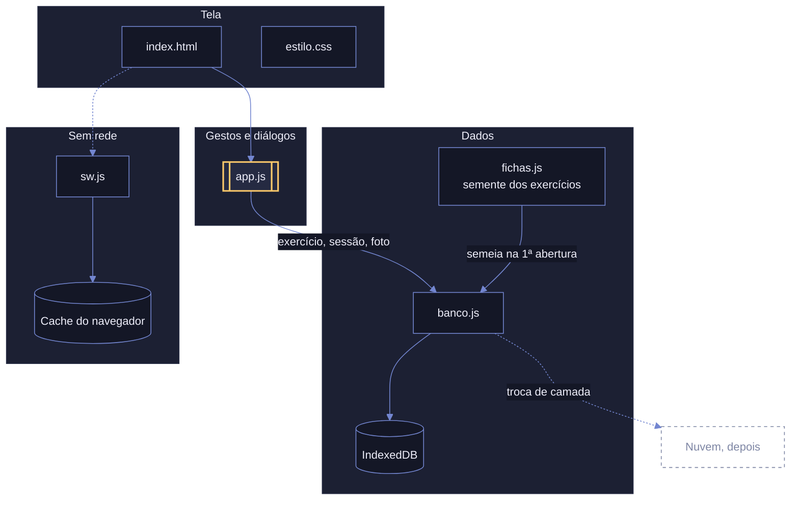
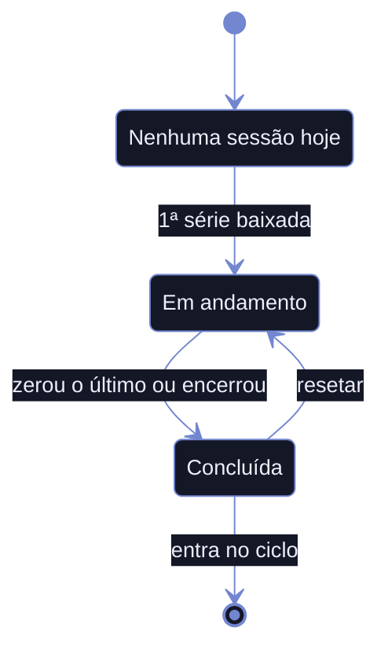
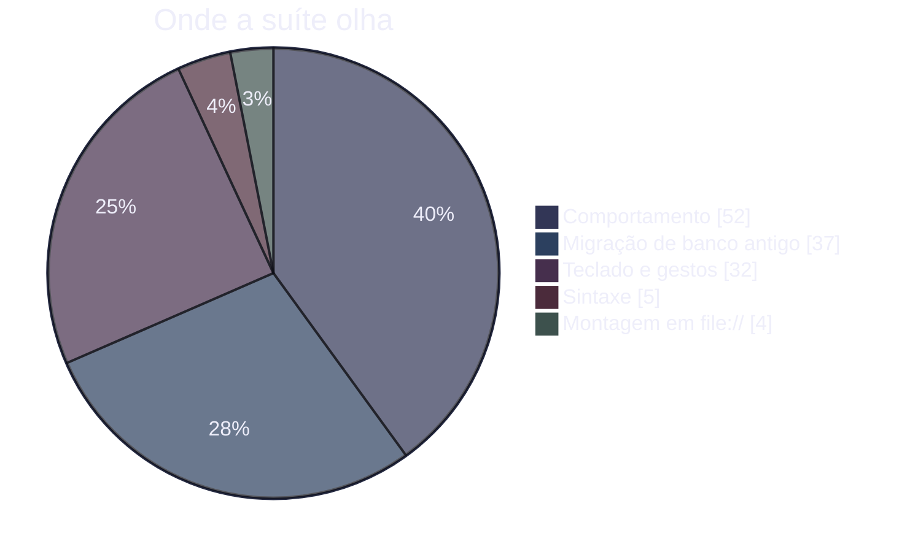

<div align="center">


# Sunshine

**Contador de séries para treino de academia.**
Instalável, sem servidor, sem build, e abre sem rede.

[**Abrir o app**](https://v-amorim.github.io/academia/)


</div>

Dois perfis treinam sobre o mesmo catálogo, cada um com o próprio progresso. Na academia o app
abre sem sinal, e o dedo faz tudo com uma mão só.

## O que ele faz

| | |
| --- | --- |
| **Contador de séries** | Um toque desce uma série. Segurar e arrastar ajusta no lugar, como o seletor de hora do celular. As setas do teclado fazem o mesmo |
| **Ciclo de treinos** | De um treino em diante, com nomes livres. Concluir todos libera o reinício |
| **Detalhe do exercício** | Aparelho, código do vídeo, três fotos da máquina e um campo para as regulagens |
| **Foto em tela cheia** | Pinça, arrasto e toque duplo |
| **Histórico automático** | A sessão do dia é o próprio registro. Não existe passo de salvar, e resetar escreve por cima em vez de apagar |

## O mapa



Uma camada só conhece o armazenamento. O resto do app fala em exercício, sessão e vaga de foto,
nunca em depósito ou chave, e é isso que faz a troca por um banco na nuvem caber num arquivo.

## O treino do dia é o próprio histórico

Não são duas coisas, então não existe passo de salvar no fim. A sessão nasce na primeira série
baixada e já é o registro que o histórico vai ler.



Encerrar no meio grava o que foi feito, e o que foi pulado entra com zero, porque pular também é
informação. Resetar escreve o total de volta em vez de apagar: o registro é histórico, e histórico
não se exclui.

## As 130 conferências



## Decisões que moldaram o código

**Sem build e sem dependências.** Os scripts são clássicos, não módulos, porque `type="module"`
não executa em `file://`. A página abre com dois cliques, o que também é o que permite
verificá-la sem servidor.

**Identificador estável.** Cada exercício tem um id fixo escrito no código, nunca sorteado em
execução: o catálogo é compartilhado entre aparelhos, e id gerado em cada um duplicaria tudo na
primeira sincronização.

**Gestos escritos à mão.** O ajuste do contador e o zoom da foto usam pointer events, não a pinça
nativa, que ampliaria a página inteira junto com o diálogo. Todo gesto de ponteiro tem equivalente
de teclado.

**Duas estratégias de cache.** Navegação busca a rede primeiro, para uma versão nova aparecer já
na primeira abertura com sinal. Arquivo do app vem do cache primeiro, porque abrir rápido na
academia vale mais do que ter o CSS da última hora.

**Diálogo é `<dialog>` nativo.** Prisão de foco, Escape, foco de volta no gatilho e fundo inerte
vêm de graça. Tocar fora fecha qualquer um, e fechar assim é sempre cancelar.

## Rodar

Abra `index.html` com dois cliques, ou sirva por HTTP:

```bash
npx --yes http-server -p 8080     # com Node
python3 -m http.server 8080       # com Python
```

> [!IMPORTANT]
> Por `file://` o app funciona mas **não salva nada**, e um aviso no topo diz isso. O navegador
> bloqueia IndexedDB em origem opaca, recusa a fonte local e não registra o service worker.
> Sirva por HTTP para o app guardar séries e fotos.

## Verificar

```bash
node verificar.mjs
```

São 130 conferências em três camadas, sem framework de teste: a sintaxe dos cinco arquivos JS, a
montagem da tela em `file://` e o comportamento num Chrome de verdade servido por HTTP, com perfil
novo a cada caso para o banco nascer limpo.

<details>
<summary>Como a suíte funciona, e o que ela não alcança</summary>

Um servidor `node:http` injeta uma sonda na página, a página devolve o resultado por `fetch`, e
nenhum número fica escrito na suíte: quantos treinos, quantos exercícios, quantas séries e quantas
repetições saem todos da semente. Trocar o catálogo por quatro treinos de nomes livres, ou por um
treino só, mantém a suíte verde.

Ela cobre contador, ajuste por arrasto, encerramento, reset, ciclo, perfis, fotos, observação,
zoom, teclado, instalação e a subida de um banco de versão antiga com fotos gravadas.

É validada por mutação: quebra-se uma linha de propósito e confere-se que a asserção certa fica
vermelha. Foi assim que se descobriu que "recomeçar o ciclo" estava coberto pela metade.

Fora do alcance dela, só no aparelho: câmera, instalação na tela inicial e a persistência real do
armazenamento no iOS.

Precisa de Node 20.11 ou mais novo e do Chrome instalado. Funciona no macOS, no Windows e no
Linux; se o Chrome estiver noutro caminho, acrescente em `CAMINHOS_CHROME`.

</details>

<details>
<summary>Os arquivos</summary>

| Arquivo | Conteúdo |
| --- | --- |
| `index.html` | Só a marcação |
| `estilo.css` | Tokens de cor e todo o estilo |
| `mulish.woff2` | A fonte, servida do próprio repositório para funcionar sem rede |
| `fichas.js` | Os exercícios e os perfis |
| `banco.js` | Acesso a dado. Único arquivo que toca IndexedDB e localStorage |
| `app.js` | Tela, gestos e diálogos |
| `sonda.js` | As asserções que rodam com o app montado no navegador |
| `sw.js` | Service worker. Guarda o app para abrir sem rede |
| `manifest.json` | Nome, cores e ícones da instalação |
| `icone.svg` | Fonte dos ícones. Os PNG saem dele |
| `verificar.mjs` | Verificação sem celular. Serve o app, sobe o Chrome e lê o resultado |

A ordem dos scripts em `index.html` importa: `fichas.js`, depois `banco.js`, depois `app.js`.

</details>
